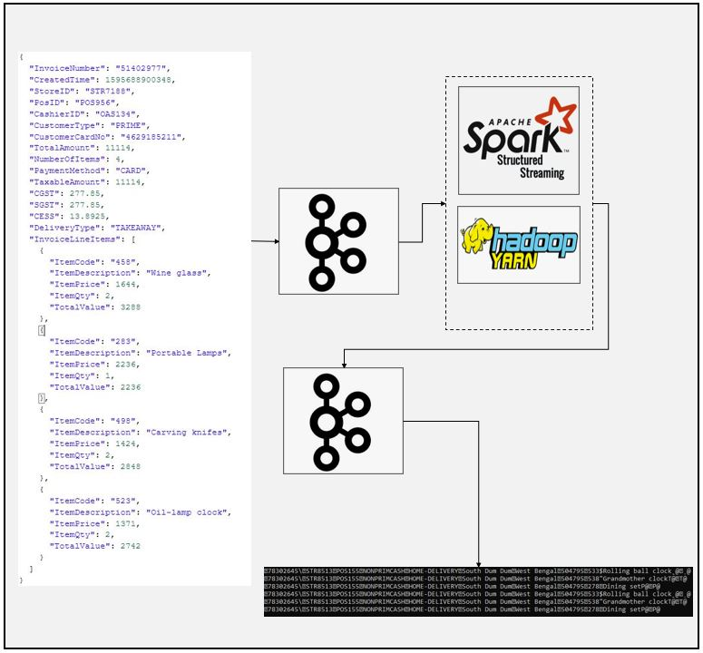

# SparkStream Kafka-Json to Kafka-Avro Transform Example
### Dataflow Pipeline


### Summary

This is kafka-json source kafka-avro sink spark application example. In this application json data send to kafka topic using kafka console producer and spark application reads data deserialize data to implement required transform to flatten data before sending them to another kafka topic again. Serilization implemented as avro format before sending it to another kafka topic.

### Task List

```json
{
  "InvoiceNumber": "51402977",
  "CreatedTime": 1595688900348,
  "StoreID": "STR7188",
  "PosID": "POS956",
  "CashierID": "OAS134",
  "CustomerType": "PRIME",
  "CustomerCardNo": "4629185211",
  "TotalAmount": 11114,
  "NumberOfItems": 4,
  "PaymentMethod": "CARD",
  "TaxableAmount": 11114,
  "CGST": 277.85,
  "SGST": 277.85,
  "CESS": 13.8925,
  "DeliveryType": "TAKEAWAY",
  "InvoiceLineItems": [
    {
      "ItemCode": "458",
      "ItemDescription": "Wine glass",
      "ItemPrice": 1644,
      "ItemQty": 2,
      "TotalValue": 3288
    },
    {
      "ItemCode": "283",
      "ItemDescription": "Portable Lamps",
      "ItemPrice": 2236,
      "ItemQty": 1,
      "TotalValue": 2236
    },
    {
      "ItemCode": "498",
      "ItemDescription": "Carving knifes",
      "ItemPrice": 1424,
      "ItemQty": 2,
      "TotalValue": 2848
    },
    {
      "ItemCode": "523",
      "ItemDescription": "Oil-lamp clock",
      "ItemPrice": 1371,
      "ItemQty": 2,
      "TotalValue": 2742
    }
  ]
}
```
### Task List

- [x] Create kafka topics
```
/home/enes/Software/kafka_2.12-2.7.0/bin/kafka-topics.sh --create --zookeeper localhost:2181 --replication-factor 1 --partitions 1 --topic invoices
/home/enes/Software/kafka_2.12-2.7.0/bin/kafka-topics.sh --create --zookeeper localhost:2181 --replication-factor 1 --partitions 1 --topic invoice-items
```

- [x] Create spark session (You can use ".master("local[*])" instead of yarn if you are running Spark on standalone mode")
```
if __name__ == "__main__":
    spark = SparkSession \
        .builder \
        .appName("Kafka stream") \
        .config("spark.streaming.stop.stopGracefullyOnShutdown", "true") \
        .master("yarn") \
        .getOrCreate()
```
- [x] Define schema
```
#Define schema for invoice data
    schema = StructType([
    StructField("InvoiceNumber", StringType()),
    StructField("CreatedTime", LongType()),
    StructField("StoreID", StringType()),
    StructField("PosID", StringType()),
    StructField("CashierID", StringType()),
    StructField("CustomerType", StringType()),
    StructField("CustomerCardNo", StringType()),
    StructField("TotalAmount", DoubleType()),
    StructField("NumberOfItems", IntegerType()),
    StructField("PaymentMethod", StringType()),
    StructField("CGST", DoubleType()),
    StructField("SGST", DoubleType()),
    StructField("CESS", DoubleType()),
    StructField("DeliveryType", StringType()),
    StructField("DeliveryAddress", StructType([
        StructField("AddressLine", StringType()),
        StructField("City", StringType()),
        StructField("State", StringType()),
        StructField("PinCode", StringType()),
        StructField("ContactNumber", StringType())
    ])),
    StructField("InvoiceLineItems", ArrayType(StructType([
        StructField("ItemCode", StringType()),
        StructField("ItemDescription", StringType()),
        StructField("ItemPrice", DoubleType()),
        StructField("ItemQty", IntegerType()),
        StructField("TotalValue", DoubleType())
    ]))),
])

```
- [x] Read data from kafka topic
```
# very important note: we can change readStream to read if we want to print dataframe at anypoint otherwise streaming data frame can not be shown with .show() method
    kafka_df = spark.readStream \
        .format("kafka") \
        .option("kafka.bootstrap.servers", "localhost:9092") \
        .option("subscribe", "invoices") \
        .option("startingOffsets", "earliest") \
        .load()

```
- [x] Implement transformations
```
value_df = kafka_df.select(from_json(col("value").cast("string"), schema).alias("value")) #from_json is used to deserialize json value from string, if we use csv data we could ve been used from_csv here

explode_df = value_df.selectExpr("value.InvoiceNumber", "value.CreatedTime", "value.StoreID",
                                 "value.PosID", "value.CustomerType", "value.PaymentMethod", "value.DeliveryType",
                                 "value.DeliveryAddress.City",
                                 "value.DeliveryAddress.State", "value.DeliveryAddress.PinCode",
                                 "explode(value.InvoiceLineItems) as LineItem")

flattened_df = explode_df \
    .withColumn("ItemCode", expr("LineItem.ItemCode")) \
    .withColumn("ItemDescription", expr("LineItem.ItemDescription")) \
    .withColumn("ItemPrice", expr("LineItem.ItemPrice")) \
    .withColumn("ItemQty", expr("LineItem.ItemQty")) \
    .withColumn("TotalValue", expr("LineItem.TotalValue")) \
    .drop("LineItem")
```

- [x] Serialize data as avro format
```
kafka_target_df = flattened_df.select(expr("InvoiceNumber as key"),
                                      to_avro(struct("*")).alias("value"))
```
- [x] Writestream to another kafka topic
```
invoice_writer_query = kafka_target_df \
    .writeStream \
    .queryName("Flattened Invoice Writer") \
    .format("kafka") \
    .option("kafka.bootstrap.servers", "localhost:9092") \
    .option("topic", "invoice-items") \
    .outputMode("append") \
    .option("checkpointLocation", "Avro/chk-point-dir") \
    .start()

invoice_writer_query.awaitTermination()
```
- [x] Start kafka console producer

- [x] Send one sample of data

- [x] Start kafka console consumer

- [x] Check results

### Code Description

kafka2kafka_avro_multi_sparkstream.py is spark script to make desired transformations and write them to the another kafka topic. This is an example to show serialization using avro format. Do not forget to import spark-avro package from maven repository.

### Running

1. Create kafka topics

2. Start spark job
```
spark-submit --packages org.apache.spark:spark-sql-kafka-0-10_2.12:3.1.1,org.apache.spark:spark-avro_2.12:3.1.1 kafka2kafka_avro_multi_sparkstream.py
```
3. Start kafka producer

4. Send one line of data

5. Start kafka consumer

6. Check result

Result will be something like this since it is binary avro format, It is not human readable
```
78302645\STR8513POS155NONPRIMCASHHOME-DELIVERYSouth Dum DumWest Bengal504795533$Rolling ball clock̙@̩@
78302645\STR8513POS155NONPRIMCASHHOME-DELIVERYSouth Dum DumWest Bengal504795538"Grandmother clockT@T@
78302645\STR8513POS155NONPRIMCASHHOME-DELIVERYSouth Dum DumWest Bengal504795278Dining setP@P@
78302645\STR8513POS155NONPRIMCASHHOME-DELIVERYSouth Dum DumWest Bengal504795533$Rolling ball clock̙@̩@
78302645\STR8513POS155NONPRIMCASHHOME-DELIVERYSouth Dum DumWest Bengal504795538"Grandmother clockT@T@
78302645\STR8513POS155NONPRIMCASHHOME-DELIVERYSouth Dum DumWest Bengal504795278Dining setP@P@
```
